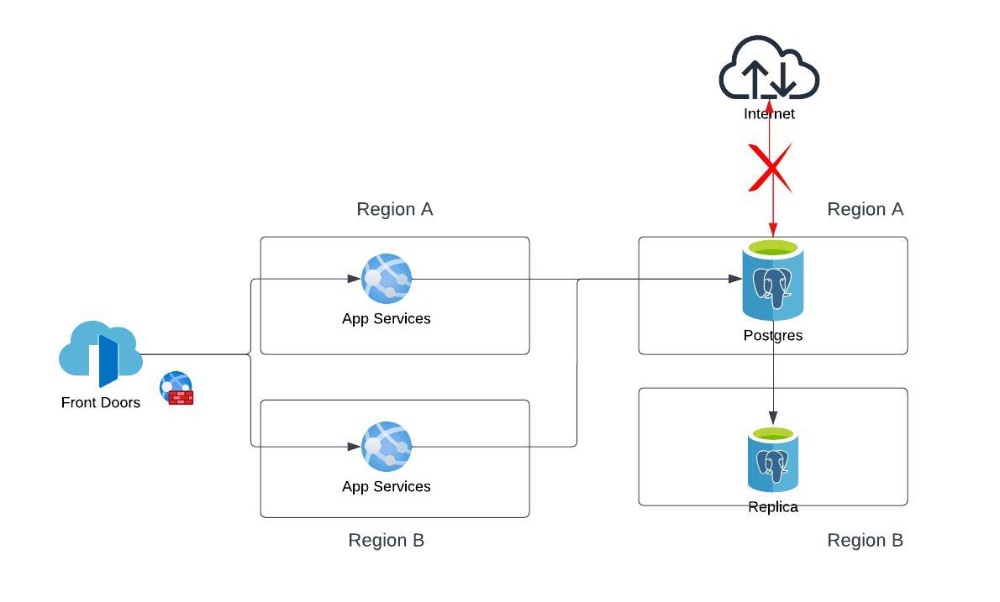
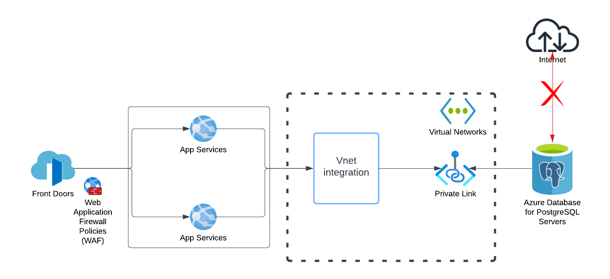

# Getting Things Done App
## Description:
This is a single page application designed to be run inside a container or on a vm (IaaS) with a postgres database to store data. 

# 2. Architecture
- Architecture


- Architecture with VNET



# 2. Guides to deploy
 - Pre-resquisites:
    - Have the following installed:
        - terrform > 1.3
        - azure cli
        - powershell
    - Have a contributor acess to an Azure account and subscription 

    - Azure AD App Service Principal: 
        - Terraform uses a Service Principal credentials to authenticate to your Azure subscription. 
        - To create a App Service Principal with a contributor privileges, follow the microsoft document [Create App service principal](https://learn.microsoft.com/en-us/azure/active-directory/develop/howto-create-service-principal-portal)
        - Use existing or create a new application secret. 
        - *Please take notes of the those secrets and use when running terraform apply*
            - Subcription ID
            - Tenant ID
            - Application ID
            - Secret ID

- Deployment: 
    - Navigate to Infrastructure folder.
    - Execute terraform, and enter the values above when prompted:

            ```
            terraform init

            terraform apply
            ```
